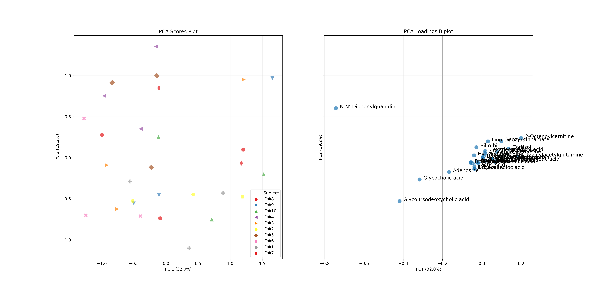
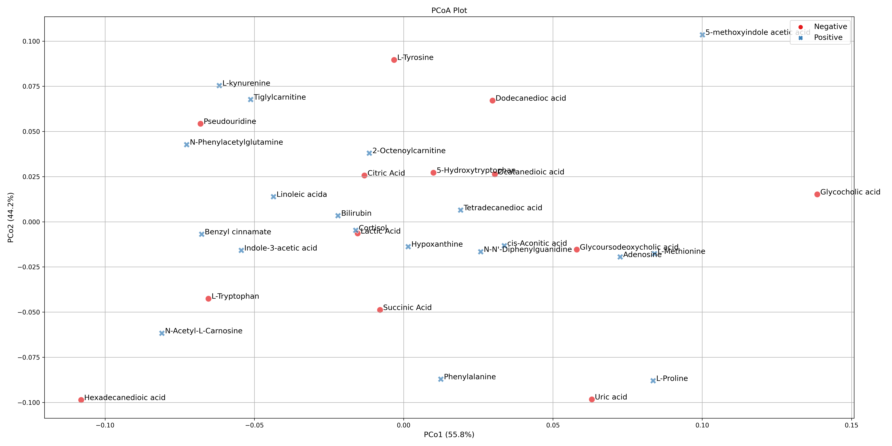
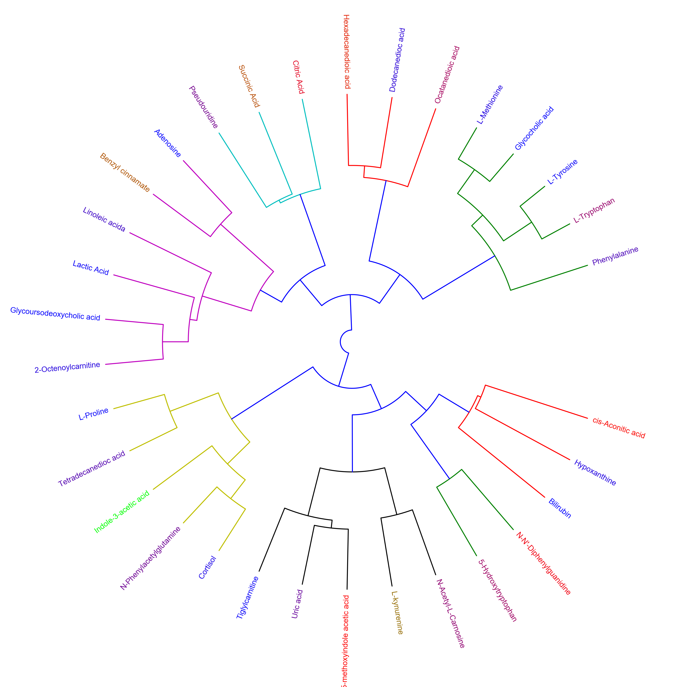

# README.md - `Chapman_et_al_2020`

<p align="justify">
This repository contains the tutorials for the Metabolomics review paper "Multivariate visualisation strategies in metabolomics: A review". There are six different tutorials explaining visualisations from PCA, PCoA, Hierarchical Clustered Heatmaps (HCH), Polar Dendrograms, Spring-embedded network plots, and Hierarchical Edge Bundle plots, all demonstrated using a dataset from (<a href="https://physoc.onlinelibrary.wiley.com/doi/full/10.1113/EP087159">Lawler et al. (2018)</a>) published in <i>Experimental Physiology</i>. The tutorials stress the importance of multivariate analysis and provides multiple options for multivariate visualisation. Each tutorial can be downloaded and run locally through Jupyter Notebook or run on the cloud through Binder.
</p>

<br />

## Quick Start

#### *To launch the tutorial in the cloud:* [](https://mybinder.org/v2/gh/brettChapman/multivis_tutorials/master)

#### Tutorial 1:
- [](https://mybinder.org/v2/gh/brettChapman/multivis_tutorials/master?filepath=Tutorial1.ipynb)

#### Tutorial 2:
- [](https://mybinder.org/v2/gh/brettChapman/multivis_tutorials/master?filepath=Tutorial2.ipynb)

#### Tutorial 3:
- [](https://mybinder.org/v2/gh/brettChapman/multivis_tutorials/master?filepath=Tutorial3.ipynb)

#### Tutorial 4:
- [](https://mybinder.org/v2/gh/brettChapman/multivis_tutorials/master?filepath=Tutorial4.ipynb)

#### Tutorial 5:
- [](https://mybinder.org/v2/gh/brettChapman/multivis_tutorials/master?filepath=Tutorial5.ipynb)

#### Tutorial 6:
- [](https://mybinder.org/v2/gh/brettChapman/multivis_tutorials/master?filepath=Tutorial6.ipynb)

<br />

## Tutorials

1.	[Principal Component Analysis (PCA) with biplot](#one)
2.	[Principal Coordinate Analysis (PCoA)](#two)
3.	[Hierarchical Clustered Heatmap](#three)
4.	[Polar Dendrogram](#four)
5.	[Spring-embedded network](#five)
6.	[Hierarchical Edge Bundle](#six)

<br />

<a id="one"></a>
## Tutorial 1: Principal Component Analysis (PCA) with biplot
<p align="justify">
<i>In this tutorial we will step through a workflow to produce a Principal Component Analysis (PCA) with a biplot. PCA is an exploratory multivariate data analysis technique which given a set of transformed and scaled observable variables can explain the degree of variance across a group of samples through their principal components. PCA is interpreted through the identification of any groups of samples which may cluster within any of the given axes along the principal components, indicating correlation within the groups, but does not indicate to which degree they are correlated. The overlay of loadings biplots indicate which metabolites contribute variance to which group of samples, and depending on the axes to which the biplot vectors project towards, indicate the relative direction of metabolite regulation.</i>
</p>

Launch tutorial 1 by clicking the "Launch Binder" icon: [](https://mybinder.org/v2/gh/brettChapman/multivis_tutorials/master?filepath=Tutorial1.ipynb)



<br />

<a id="two"></a>
## Tutorial 1: Principal Coordinate Analysis (PCoA)
<p align="justify">
<i>In this tutorial we will step through a workflow to produce a Principal Coordinate Analysis (PCoA) plot. PCoA, also known as Classical Multidimensional Scaling (CMDS), is another multivariate data analysis or ordination method similar to PCA, however it takes a similarity matrix and instead of computing the maximal variance like with PCA, it computes the maximal linear correlation between similarities in the similarity matrix by way of PCA, and projects them to a lower dimensional space.</I>
</p>

Launch tutorial 2 by clicking the "Launch Binder" icon: [](https://mybinder.org/v2/gh/brettChapman/multivis_tutorials/master?filepath=Tutorial2.ipynb)



<br />

<a id="three"></a>
## Tutorial 3: Hierarchical Clustered Heatmap
<p align="justify">
<i>In this tutorial we will step through a workflow to produce a Hierarchical Clustered Heatmap (HCH). HCH is an exploratory data analysis technique which implements a two-way Hierarchical cluster analysis (HCA) (e.g. clustering samples and features (metabolites)), and provides dendrograms and heatmaps to visualise the clustered data. HCA is a method by which the distance or correlation between individuals is measured, and then grouped together based on the similarities or dissimilarities between the distances or correlations of the individuals. The clustering itself is based on linkage clustering and determines the overall structure of the clusters. HCH is interpreted through visually identify the different clusters in the heatmap as groups of different colour representations of the clustering score, with the highest score representing one colour choice, and the lowest score representing the other colour choice, and everything in between being lighter or darker shade variants. The different clustered colours in the heatmap are also represented in the dendrograms for each axis as clustered branches.</i>
</p>

Launch tutorial 2 by clicking the "Launch Binder" icon: [](https://mybinder.org/v2/gh/brettChapman/multivis_tutorials/master?filepath=Tutorial3.ipynb)


<br />

<a id="four"></a>
## Tutorial 4: Polar Dendrogram
<i>In this tutorial we will step through a workflow to produce a Polar dendrogram. Polar dendrograms are simply a circular form of a dendrogram based on the hierarchical structure of the similarity or dissimilarities from HCA. Polar dendrograms are interpreted by visually identifying the different clustered branches containing closely associated metabolites, the same way with dendrograms in HCH, however now following a circular format.</i>

Launch tutorial 4 by clicking the "Launch Binder" icon: [](https://mybinder.org/v2/gh/brettChapman/multivis_tutorials/master?filepath=Tutorial4.ipynb)



<br />

<a id="five"></a>
## Tutorial 5: Spring-embedded network
<i>In this tutorial we will step through a workflow to produce a Spring-embedded network (SEN) plot. SEN plots provide a means to represent correlations in an undirected graph where each node represents a metabolite and the spring constant of each edge between nodes represents the correlation coefficient. When the tension on the graph is allowed to relax and put in a low energy configuration, the springs push the nodes to their furthest allowed distance from each other in the graph layout. Where there are edges with higher correlation coefficients the spring tightens bringing nodes closer together and where there are lower correlation coefficients the spring loosens and stretches. SEN plots form a type of multivariate cluster analysis, where nodes clustered together are more positively correlated and nodes further apart are considered more negatively correlated. Additionally, univariate statistical analysis is also included in the form of p-values and other univariate statistics, such as p-values used for the size of nodes (which can be made to be inversely proportional with larger nodes being more significant), or VIP scores, D-ratio etc. The colours of the nodes can also be associated with other variables such as correlation to drug concentrations, positive/negative fold change, classes of metabolites or other data types, and the colours of the edges can also be used to represent the positive/negative value of the correlations. SEN plots can also be made to be interactive, allowing for further exploratory data analysis.</i>

Launch tutorial 5 by clicking the "Launch Binder" icon: [](https://mybinder.org/v2/gh/brettChapman/multivis_tutorials/master?filepath=Tutorial5.ipynb)

<iframe width="115%" height="1000" src="springNetwork.html" allowfullscreen="allowfullscreen" frameborder="0"></iframe>


<br />

<a id="six"></a>
## Tutorial 6: Hierarchical Edge Bundle
<i>In this tutorial we will step through a workflow to produce a Hierarchical edge bundle (HEB) plot. HEB plots are another means to visualise correlations in a circular hierarchical tree structure, with nodes on the outside and edges passing through the circle following a bundled curve until they connect to other nodes. The edges represent correlation coefficients and can be coloured accordingly based on the sign of the correlation and different classes or groups within the data can also be reflected in the HEB plot to illustrate how the different groups are correlated and to what degree. HEB plots are also interactive, allowing for further exploratory data analysis.</i>

Launch tutorial 6 by clicking the "Launch Binder" icon: [](https://mybinder.org/v2/gh/brettChapman/multivis_tutorials/master?filepath=Tutorial6.ipynb)

<iframe width="115%" height="1000" src="hEdgeBundle.html" allowfullscreen="allowfullscreen" frameborder="0"></iframe>

<br/>

## Download the notebook from Binder

To download the notebook (as changes to the notebook are lost when the Binder session end):
    1. Return to Jupyter landing page, by choosing "File" then "Open.."
    2. Click the checkbox next to each file you wish to download
    3. Click the 'Download' button from the top menu

## Create a Local Copy:

#### Step 1. Install Jupyter and Python using Anaconda

1. Go to the [Official Anaconda Website](https://www.anaconda.com/distribution/) and click the 'Download' button.
2. Press the 'Download' button under the 'Python 3.7 version' in Bold to download the graphical installer for your OS.
3. After the download has finished, open (double-click) the installer to begin installing the Anaconda Distribution
4. Follow the prompts on the graphical installer to completely install the Anaconda Distribution (The final page is 'Thanks for installing Anaconda3')
5. Open the app called 'Anaconda Navigator' and press the 'launch' button in the 'Jupyter Notebook' box (to open Jupyter Notebook / confirm it was successfuly installed)
<br /><br />

#### Step 2. Create a local copy using the Anaconda Navigator app

1. Go to https://github.com/brettChapman/multivis_tutorials
2. Press the green 'Clone or Download', and then click 'Download zip'
3. Move this downloaded folder to a suitable directory (by default it is is the 'Download' folder)
4. Open the Anaconda Navigator Application
5. Move from the 'Home' tab to the 'Environment' tab (on the left side)
6. Click import (at the bottom), which opens a box called 'Import New Enviroment'
7. In 'Import New Enviroment', press the 'folder' icon and navigate to the 'environment.yml' file in the folder downloaded in step 2/3.
8. Click Import and wait for the environment to install (note: may take 5-10 minutes)
9. Return to the 'Home' tab
10. Change 'Application on... base(root)' to 'Application on... multivis_tutorials' (at the top)
11. Press the 'Launch' button under the 'Jupyter Notebook' box
12. Using the Notebook Dashboard, locate the downloaded folder in step 2/3 and open (double-click) on the 'Tutorial*.ipynb'.
<br /><br />

#### Step 2. Create a local copy using Terminal / Command Prompt **(Alternative)**
1. Open Terminal on Linux/MacOS or Command Prompt on Windows
2. Enter the following into the console (one line at a time)

```console
git clone https://github.com/brettChapman/multivis_tutorials
cd multivis_tutorials
conda env create -f environment.yml
source activate multivis_tutorials
jupyter notebook
```

Note: if you recieve the following error, "fatal: destination path 'multivis_tutorials' already exists and is not an empty directory". You need to delete the 'multivis_tutorials' folder in that current directory or move to a new directory. This folder can be deleted using Terminal / Command Prompt  with:
```console
rm -rf multivis_tutorials
```
