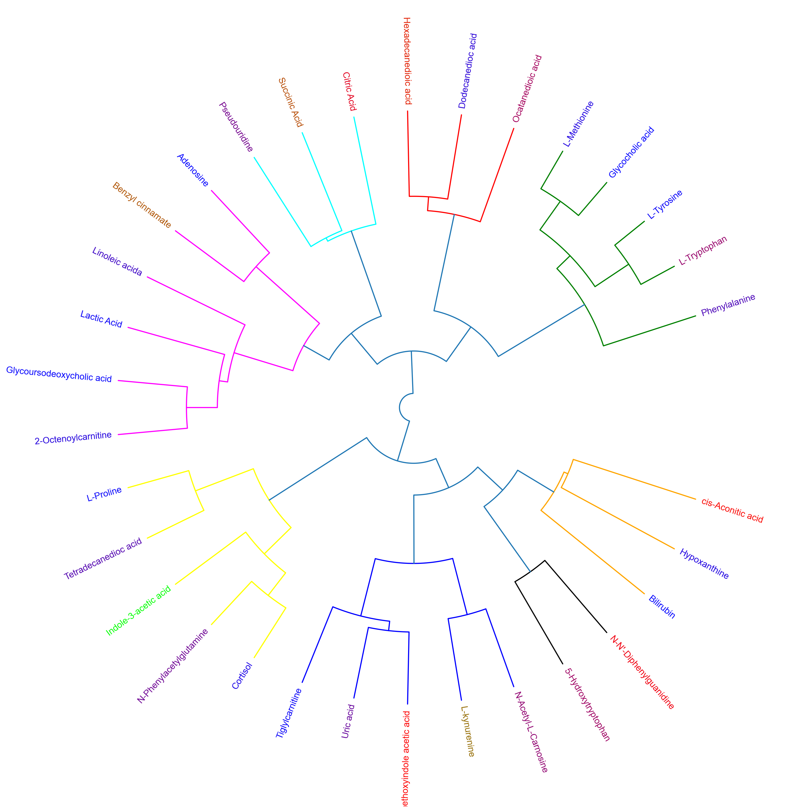

# README.md

<p align="justify">
This repository contains twelve different tutorials spanning two case studies, explaining visualisations, from PCA, PCA loadings lollipop plots, PCoA, Hierarchical Clustered Heatmaps (HCH), Polar Dendrograms, Peak area plots, Spring-embedded network plots, and Hierarchical Edge Bundle plots, with included statistical analysis. Tutorials 1.1 to 1.6 cover a dataset from (<a href="https://physoc.onlinelibrary.wiley.com/doi/full/10.1113/EP087159">Lawler et al. (2018)</a>) published in <i>Experimental Physiology</i>, while tutorials 2.1 to 2.6 cover a dataset from (<a href="https://www.ncbi.nlm.nih.gov/pmc/articles/PMC4716538/">Chan, A, et al. (2016)</a>) published in <i>British Journal of Cancer</i>. The tutorials stress the importance of multivariate analysis and provide multiple options for statistical analysis and multivariate visualisation. Each tutorial can be downloaded and run locally through Jupyter Notebook or run on the cloud through Binder.
</p>

<br />

## Quick Start

#### *To launch the tutorial in the cloud:* [](https://mybinder.org/v2/gh/brettChapman/multivis_tutorials/master)

#### Tutorial 1: Metabolomics of athlete performance at high altitude

#### Tutorial 1.1:
- [](https://mybinder.org/v2/gh/brettChapman/multivis_tutorials/master?filepath=Tutorial1.1.ipynb)

#### Tutorial 1.2:
- [](https://mybinder.org/v2/gh/brettChapman/multivis_tutorials/master?filepath=Tutorial1.2.ipynb)

#### Tutorial 1.3:
- [](https://mybinder.org/v2/gh/brettChapman/multivis_tutorials/master?filepath=Tutorial1.3.ipynb)

#### Tutorial 1.4:
- [](https://mybinder.org/v2/gh/brettChapman/multivis_tutorials/master?filepath=Tutorial1.4.ipynb)

#### Tutorial 1.5:
- [](https://mybinder.org/v2/gh/brettChapman/multivis_tutorials/master?filepath=Tutorial1.5.ipynb)

#### Tutorial 1.6:
- [](https://mybinder.org/v2/gh/brettChapman/multivis_tutorials/master?filepath=Tutorial1.6.ipynb)

#### Tutorial 2: Metabolomics of Gastric Cancer

#### Tutorial 2.1:
- [](https://mybinder.org/v2/gh/brettChapman/multivis_tutorials/master?filepath=Tutorial2.1.ipynb)

#### Tutorial 2.2:
- [](https://mybinder.org/v2/gh/brettChapman/multivis_tutorials/master?filepath=Tutorial2.2.ipynb)

#### Tutorial 2.3:
- [](https://mybinder.org/v2/gh/brettChapman/multivis_tutorials/master?filepath=Tutorial2.3.ipynb)

#### Tutorial 2.4:
- [](https://mybinder.org/v2/gh/brettChapman/multivis_tutorials/master?filepath=Tutorial2.4.ipynb)

#### Tutorial 2.5:
- [](https://mybinder.org/v2/gh/brettChapman/multivis_tutorials/master?filepath=Tutorial2.5.ipynb)

#### Tutorial 2.6:
- [](https://mybinder.org/v2/gh/brettChapman/multivis_tutorials/master?filepath=Tutorial2.6.ipynb)

<br />

## Tutorials

1.1.	[Athlete performance at high altitude - Principal Component Analysis (PCA) with biplot, and PCA lollipop plots](#one) <br>
1.2.	[Athlete performance at high altitude - Principal Coordinate Analysis (PCoA) with included statistical analysis](#two) <br>
1.3.	[Athlete performance at high altitude - Hierarchical Clustered Heatmap](#three) <br>
1.4.	[Athlete performance at high altitude - Polar Dendrogram with included statistical analysis](#four) <br>
1.5.	[Athlete performance at high altitude - Spring-embedded network with included statistical analysis](#five) <br>
1.6.	[Athlete performance at high altitude - Hierarchical Edge Bundle with included statistical analysis](#six) <br>

<br />

2.1.	[Gastric Cancer - Principal Component Analysis (PCA) with biplot, and PCA lollipop plots](#one) <br>
2.2.	[Gastric Cancer - Principal Coordinate Analysis (PCoA) with included statistical analysis](#two) <br>
2.3.	[Gastric Cancer - Hierarchical Clustered Heatmap](#three) <br>
2.4.	[Gastric Cancer - Polar Dendrogram with included statistical analysis](#four) <br>
2.5.	[Gastric Cancer - Spring-embedded network with included statistical analysis](#five) <br>
2.6.	[Gastric Cancer - Hierarchical Edge Bundle with included statistical analysis](#six) <br>

<br />

<a id="one"></a>
## Tutorial 1.1 and 2.1: Principal Component Analysis (PCA) with biplot
<p align="justify">
<i>These tutorials step through a workflow to produce a Principal Component Analysis (PCA) with a biplot, and also PCA lollipop plot. PCA is an exploratory multivariate data analysis technique which given a set of transformed and scaled observable variables can explain the degree of variance across a group of samples through their principal components. PCA is interpreted through the identification of any groups of samples which may cluster within any of the given axes along the principal components, indicating correlation within the groups, but does not indicate to which degree they are correlated. The overlay of loadings biplots indicate which features (e.g. metabolites) contribute variance to which group of samples, and depending on the axes to which the biplot vectors project towards, indicate the relative direction of metabolite regulation. A PCA lollipop plot with bootstrapped confidence intervals is also included to indicate which features contribute to each component, and which are statistically significant.</I>
</p>

Launch tutorial 1.1 by clicking the "Launch Binder" icon: [](https://mybinder.org/v2/gh/brettChapman/multivis_tutorials/master?filepath=Tutorial1.1.ipynb)
<br>
Launch tutorial 2.1 by clicking the "Launch Binder" icon: [](https://mybinder.org/v2/gh/brettChapman/multivis_tutorials/master?filepath=Tutorial2.1.ipynb)

### Example plots from tutorial 1.1:


<br />


<br />


<br />

### Example plots from tutorial 2.1:


<br />


<br />


<br />

<a id="two"></a>
## Tutorial 1.2 and 2.2: Principal Coordinate Analysis (PCoA)
<p align="justify">
<i>These tutorials step through a workflow to produce a Principal Coordinate Analysis (PCoA) plot. PCoA, also known as Classical Multidimensional Scaling (CMDS), is another multivariate data analysis or ordination method similar to PCA, however it takes a similarity matrix and instead of computing the maximal variance like with PCA, it computes the maximal linear correlation between similarities in the similarity matrix by way of PCA, and projects them to a lower dimensional space.</I>
</p>

Launch tutorial 1.2 by clicking the "Launch Binder" icon: [](https://mybinder.org/v2/gh/brettChapman/multivis_tutorials/master?filepath=Tutorial1.2.ipynb)
<br>
Launch tutorial 2.2 by clicking the "Launch Binder" icon: [](https://mybinder.org/v2/gh/brettChapman/multivis_tutorials/master?filepath=Tutorial2.2.ipynb)

### Example plot from tutorial 1.2:


<br />

### Example plot from tutorial 2.2:


<br />

<a id="three"></a>
## Tutorial 1.3 and 2.3: Hierarchical Clustered Heatmap
<p align="justify">
<i>These tutorials step through a workflow to produce a Hierarchical Clustered Heatmap (HCH). HCH is an exploratory data analysis technique which implements a two-way Hierarchical cluster analysis (HCA) (e.g. clustering samples and features (e.g. metabolites)), and provides dendrograms and heatmaps to visualise the clustered data. HCA is a method by which the distance or correlation between individuals is measured, and then grouped together based on the similarities or dissimilarities between the distances or correlations of the individuals. The clustering itself is based on linkage clustering and determines the overall structure of the clusters. HCH is interpreted through visually identify the different clusters in the heatmap as groups of different colour representations of the clustering score, with the highest score representing one colour choice, and the lowest score representing the other colour choice, and everything in between being lighter or darker shade variants. The different clustered colours in the heatmap are also represented in the dendrograms for each axis as clustered branches.</i>
</p>

Launch tutorial 1.3 by clicking the "Launch Binder" icon: [](https://mybinder.org/v2/gh/brettChapman/multivis_tutorials/master?filepath=Tutorial1.3.ipynb)
<br>
Launch tutorial 2.3 by clicking the "Launch Binder" icon: [](https://mybinder.org/v2/gh/brettChapman/multivis_tutorials/master?filepath=Tutorial2.3.ipynb)

### Example plot from tutorial 1.3:


<br />

### Example plot from tutorial 2.3:


<br />

<a id="four"></a>
## Tutorial 1.4 and 2.4: Polar Dendrogram
<i>These tutorials step through a workflow to produce a Polar dendrogram. Polar dendrograms are simply a circular form of a dendrogram based on the hierarchical structure of the similarity or dissimilarities from HCA. Polar dendrograms are interpreted by visually identifying the different clustered branches containing closely associated features (e.g. metabolites), the same way with dendrograms in HCH, however now following a circular format. The mean or median peak area of each of the clusters is then determined to identify the overall trajectories of features between different groups/classes, to assist in elucidating their biological context.</I>

Launch tutorial 1.4 by clicking the "Launch Binder" icon: [](https://mybinder.org/v2/gh/brettChapman/multivis_tutorials/master?filepath=Tutorial1.4.ipynb)
<br>
Launch tutorial 2.4 by clicking the "Launch Binder" icon: [](https://mybinder.org/v2/gh/brettChapman/multivis_tutorials/master?filepath=Tutorial2.4.ipynb)

### Example plot from tutorial 1.4:



### Example plot of mean peak areas of clusters from polar dendrogram in tutorial 1.4:


<br />

### Example plot from tutorial 2.4:


### Example plot of median peak areas of clusters from polar dendrogram in tutorial 2.4:


<br />

<a id="five"></a>
## Tutorial 1.5 and 2.5: Spring-embedded network
<i>These tutorials will step through a workflow to produce a single-block and multi-block spring-embedded network (SEN) plot. SEN plots provide a means to represent how different features are associated with each other, as well as they associate between different groups/classes, as an undirected graph where each node represents a feature (e.g. metabolite) and the spring constant of each edge between nodes represents some association value such as correlation coefficient. When the tension on the graph is allowed to relax and put in a low energy configuration, the springs push the nodes to their furthest allowed distance from each other in the graph layout. Where there are edges with higher values the spring tightens bringing nodes closer together and where there are lower values the spring loosens and stretches. SEN plots form a type of multivariate cluster analysis, where nodes clustered together are more positively associated together and nodes further apart are considered more negatively associated. The inclusion of univariate and multivariate statistical analysis outputs in the form of pvalues, mean/median fold changes, and PC loadings, and any other type of statistical outputs provide another layer of information by illustrating such information as different sizes or colours of nodes. The colours of the nodes can also be associated with other variables such as correlation to drug concentrations, positive/negative fold change, classes of features (e.g. metabolites) or other data types, and the colours of the edges can also be used to represent the positive/negative value of the correlations. Statistical analysis is included in this tutorial to provide a means to filter outliers, remove data with missing values, determine the normality of the data, and to add any further univariate and multivariate statistics to the network plot. Generation of the spring-embedded network is not limited to interpreting matrices of correlation coefficients, but can take any values as long as the matrix contains features on the x-axis and groups/categories/samples on the y-axis. The number of counts of features assigned to different categories can also be used, for example different genomes on the x-axis vs identified protein family domains on the y-axis or using an every day example the number of times individuals visited destinations. All this data can be visualised as a network to identify patterns and previously un-identified associations.</I>

Launch tutorial 1.5 by clicking the "Launch Binder" icon: [](https://mybinder.org/v2/gh/brettChapman/multivis_tutorials/master?filepath=Tutorial1.5.ipynb)
<br>
Launch tutorial 2.5 by clicking the "Launch Binder" icon: [](https://mybinder.org/v2/gh/brettChapman/multivis_tutorials/master?filepath=Tutorial2.5.ipynb)

### Example single-block plots from tutorial 1.5:

## Positive correlation network

<iframe width="100%" height="1200" src="springNetwork_positive_single-block_altitude_study.html" allowfullscreen="allowfullscreen" frameborder="0"></iframe>

<br />

## Negative correlation network

<iframe width="100%" height="1200" src="springNetwork_negative_single-block_altitude_study.html" allowfullscreen="allowfullscreen" frameborder="0"></iframe>

<br />

### Example single-block plots with a dashboard from tutorial 1.5:

## Positive correlation network

<iframe width="100%" height="1200" src="springNetwork_positive_single-block_altitude_study_dashboard.html" allowfullscreen="allowfullscreen" frameborder="0"></iframe>

<br />

## Negative correlation network

<iframe width="100%" height="1200" src="springNetwork_negative_single-block_altitude_study_dashboard.html" allowfullscreen="allowfullscreen" frameborder="0"></iframe>

<br />

### Example multi-block plots from tutorial 1.5:

## Positive correlation network

<iframe width="100%" height="1200" src="springNetwork_positive_multi-block_altitude_study.html" allowfullscreen="allowfullscreen" frameborder="0"></iframe>

<br />

## Negative correlation network

<iframe width="100%" height="1200" src="springNetwork_negative_multi-block_altitude_study.html" allowfullscreen="allowfullscreen" frameborder="0"></iframe>

<br />

### Example multi-block plots with a dashboard from tutorial 1.5:

## Positive correlation network

<iframe width="100%" height="1200" src="springNetwork_positive_multi-block_altitude_study_dashboard.html" allowfullscreen="allowfullscreen" frameborder="0"></iframe>

<br />

## Negative correlation network

<iframe width="100%" height="1200" src="springNetwork_negative_multi-block_altitude_study_dashboard.html" allowfullscreen="allowfullscreen" frameborder="0"></iframe>

<br />

### Example single-block plots from tutorial 2.5:

## Positive correlation network

<iframe width="100%" height="1200" src="springNetwork_positive_single-block_gastric_cancer.html" allowfullscreen="allowfullscreen" frameborder="0"></iframe>

<br />

### Example single-block plots with a dashboard from tutorial 2.5:

## Positive correlation network

<iframe width="100%" height="1200" src="springNetwork_positive_single-block_gastric_cancer_dashboard.html" allowfullscreen="allowfullscreen" frameborder="0"></iframe>

<br />

### Example multi-block plots from tutorial 2.5:

## Positive correlation network

<iframe width="100%" height="1200" src="springNetwork_positive_multi-block_gastric_cancer.html" allowfullscreen="allowfullscreen" frameborder="0"></iframe>

<br />

## Negative correlation network

<iframe width="100%" height="1200" src="springNetwork_negative_multi-block_gastric_cancer.html" allowfullscreen="allowfullscreen" frameborder="0"></iframe>

<br />

### Example multi-block plots with a dashboard from tutorial 2.5:

## Positive correlation network

<iframe width="100%" height="1200" src="springNetwork_positive_multi-block_gastric_cancer_dashboard.html" allowfullscreen="allowfullscreen" frameborder="0"></iframe>

<br />

## Negative correlation network

<iframe width="100%" height="1200" src="springNetwork_negative_multi-block_gastric_cancer_dashboard.html" allowfullscreen="allowfullscreen" frameborder="0"></iframe>

<br />

<a id="six"></a>
## Tutorial 1.6 and 2.6: Hierarchical Edge Bundle
<i>These tutorials step through a workflow to produce a multi-block Hierarchical edge bundle (HEB) plot. HEB plots are another means to visualise associations among features and between different groups/classes, in a circular hierarchical tree structure, with nodes on the outside, optionally separated into groups/classes and edges passing through the circle following a bundled curve until they connect to other nodes. The edges represent an association value such as a correlation coefficient and can be coloured accordingly based on the sign of the association value or correlation (e.g. positively vs negatively correlated). Univariate and multivariate statistics can be embedded in the visualisation. Statistical analysis is included in this tutorial to provide a means to filter outliers, remove data with missing values, determine the normality of the data, and to add any further univariate and multivariate statistics to the hierarchical edge bundle.</I>

Launch tutorial 1.6 by clicking the "Launch Binder" icon: [](https://mybinder.org/v2/gh/brettChapman/multivis_tutorials/master?filepath=Tutorial1.6.ipynb)
<br>
Launch tutorial 2.6 by clicking the "Launch Binder" icon: [](https://mybinder.org/v2/gh/brettChapman/multivis_tutorials/master?filepath=Tutorial2.6.ipynb)

### Example plot from tutorial 1.6:

<iframe width="100%" height="1400" src="hEdgeBundle_multi-block_altitude_study.html" allowfullscreen="allowfullscreen" frameborder="0"></iframe>

<br />

### Example plot with a dashboard from tutorial 1.6:

<iframe width="100%" height="900" src="hEdgeBundle_multi-block_altitude_study_dashboard.html" allowfullscreen="allowfullscreen" frameborder="0"></iframe>

<br/>

### Example plot from tutorial 2.6:

<iframe width="100%" height="1400" src="hEdgeBundle_multi-block_gastric_cancer.html" allowfullscreen="allowfullscreen" frameborder="0"></iframe>

<br />

### Example plot with a dashboard from tutorial 2.6:

<iframe width="100%" height="900" src="hEdgeBundle_multi-block_gastric_cancer_dashboard.html" allowfullscreen="allowfullscreen" frameborder="0"></iframe>

<br/>

## Download the notebook from Binder

To download the notebook (as changes to the notebook are lost when the Binder session end):
    1. Return to Jupyter landing page, by choosing "File" then "Open.."
    2. Click the checkbox next to each file you wish to download
    3. Click the 'Download' button from the top menu

## Create a Local Copy:

#### Step 1. Install Jupyter and Python using Anaconda

1. Go to the [Official Anaconda Website](https://www.anaconda.com/distribution/) and click the 'Download' button.
2. Press the 'Download' button under the 'Python 3.7 version' in Bold to download the graphical installer for your OS.
3. After the download has finished, open (double-click) the installer to begin installing the Anaconda Distribution
4. Follow the prompts on the graphical installer to completely install the Anaconda Distribution (The final page is 'Thanks for installing Anaconda3')
5. Open the app called 'Anaconda Navigator' and press the 'launch' button in the 'Jupyter Notebook' box (to open Jupyter Notebook / confirm it was successfuly installed)
<br /><br />

#### Step 2. Create a local copy using the Anaconda Navigator app

1. Go to https://github.com/brettChapman/multivis_tutorials
2. Press the green 'Clone or Download', and then click 'Download zip'
3. Move this downloaded folder to a suitable directory (by default it is is the 'Download' folder)
4. Open the Anaconda Navigator Application
5. Move from the 'Home' tab to the 'Environment' tab (on the left side)
6. Click import (at the bottom), which opens a box called 'Import New Enviroment'
7. In 'Import New Enviroment', press the 'folder' icon and navigate to the 'environment.yml' file in the folder downloaded in step 2/3.
8. Click Import and wait for the environment to install (note: may take 5-10 minutes)
9. Return to the 'Home' tab
10. Change 'Application on... base(root)' to 'Application on... multivis_tutorials' (at the top)
11. Press the 'Launch' button under the 'Jupyter Notebook' box
12. Using the Notebook Dashboard, locate the downloaded folder in step 2/3 and open (double-click) on the 'Tutorial.ipynb'.
<br /><br />

#### Step 2. Create a local copy using Terminal / Command Prompt **(Alternative)**
1. Open Terminal on Linux/MacOS or Command Prompt on Windows
2. Enter the following into the console (one line at a time)

```console
git clone https://github.com/brettChapman/multivis_tutorials
cd multivis_tutorials
conda env create -f environment.yml
source activate multivis_tutorials
jupyter notebook
```

Note: if you recieve the following error, "fatal: destination path 'multivis_tutorials' already exists and is not an empty directory". You need to delete the 'multivis_tutorials' folder in that current directory or move to a new directory. This folder can be deleted using Terminal / Command Prompt  with:
```console
rm -rf multivis_tutorials
```
